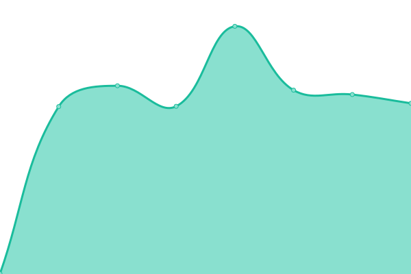
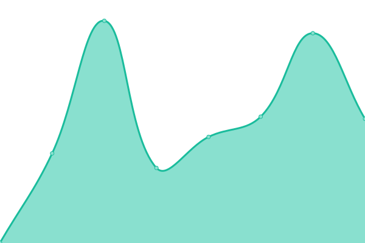
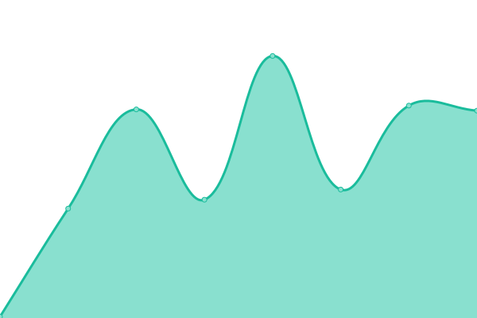

# [📈 Live Status](https://uptime.tob.ee): <!--live status--> **🟧 Partial outage**

This repository contains the open-source uptime monitor and status page for [Kingvin](https://uptime.tob.ee), powered by [Upptime](https://github.com/upptime/upptime).

With [Upptime](https://upptime.js.org), you can get your own unlimited and free uptime monitor and status page, powered entirely by a GitHub repository. We use [Issues](https://github.com/dongqw/upptime/issues) as incident reports, [Actions](https://github.com/dongqw/upptime/actions) as uptime monitors, and [Pages](https://uptime.tob.ee) for the status page.

<!--start: status pages-->
<!-- This summary is generated by Upptime (https://github.com/upptime/upptime) -->
<!-- Do not edit this manually, your changes will be overwritten -->
<!-- prettier-ignore -->
| URL | Status | History | Response Time | Uptime |
| --- | ------ | ------- | ------------- | ------ |
|  [Bee Uptime](https://uptime.tob.ee) | 🟩 Up | [bee-uptime.yml](https://github.com/dongqw/upptime/commits/HEAD/history/bee-uptime.yml) | 

 627ms
     
 | 

<a href="https://uptime.tob.ee/history/bee-uptime">100.00%</a>
    

|  [Bee Auth](https://auth.tob.ee) | 🟩 Up | [bee-auth.yml](https://github.com/dongqw/upptime/commits/HEAD/history/bee-auth.yml) | 

 1912ms
     
 | 

<a href="https://uptime.tob.ee/history/bee-auth">100.00%</a>
    

|  [Bee Pass](https://pass.tob.ee) | 🟩 Up | [bee-pass.yml](https://github.com/dongqw/upptime/commits/HEAD/history/bee-pass.yml) | 

 879ms
     
 | 

<a href="https://uptime.tob.ee/history/bee-pass">100.00%</a>
    

|  [Bee Docs](https://docs.tob.ee) | 🟩 Up | [bee-docs.yml](https://github.com/dongqw/upptime/commits/HEAD/history/bee-docs.yml) | 

 1544ms
     
 | 

<a href="https://uptime.tob.ee/history/bee-docs">100.00%</a>
    

|  [Bee S3](https://s3.tob.ee) | 🟥 Down | [bee-s3.yml](https://github.com/dongqw/upptime/commits/HEAD/history/bee-s3.yml) | 

 1374ms
     
 | 

<a href="https://uptime.tob.ee/history/bee-s3">0.00%</a>
    

|  [Bee Status](https://status.tob.ee) | 🟩 Up | [bee-status.yml](https://github.com/dongqw/upptime/commits/HEAD/history/bee-status.yml) | 

 792ms
     
 | 

<a href="https://uptime.tob.ee/history/bee-status">100.00%</a>
    

|  [Bee CDN](https://cdn.tob.ee) | 🟩 Up | [bee-cdn.yml](https://github.com/dongqw/upptime/commits/HEAD/history/bee-cdn.yml) | 

 1516ms
     
 | 

<a href="https://uptime.tob.ee/history/bee-cdn">100.00%</a>
    

|  [Bee Portainer](https://portainer.tob.ee) | 🟩 Up | [bee-portainer.yml](https://github.com/dongqw/upptime/commits/HEAD/history/bee-portainer.yml) | 

 758ms
     
 | 

<a href="https://uptime.tob.ee/history/bee-portainer">100.00%</a>
    

|  [Bee Short URL](https://tob.ee) | 🟥 Down | [bee-short-url.yml](https://github.com/dongqw/upptime/commits/HEAD/history/bee-short-url.yml) | 

 724ms
     
 | 

<a href="https://uptime.tob.ee/history/bee-short-url">0.00%</a>
    

|  Bee Subconverter | 🟥 Down | [bee-subconverter.yml](https://github.com/dongqw/upptime/commits/HEAD/history/bee-subconverter.yml) | 

 789ms
     
 | 

<a href="https://uptime.tob.ee/history/bee-subconverter">0.00%</a>
    

|  AIA | 🟥 Down | [aia.yml](https://github.com/dongqw/upptime/commits/HEAD/history/aia.yml) | 

 88ms
     
 | 

<a href="https://uptime.tob.ee/history/aia">0.00%</a>
    

<!--end: status pages-->

[**Visit our status website →**](https://uptime.tob.ee)

## 📄 License

- Powered by: [Upptime](https://github.com/upptime/upptime)
- Code: [MIT](./LICENSE) © [Kingvin](https://uptime.tob.ee)
- Data in the `./history` directory: [Open Database License](https://opendatacommons.org/licenses/odbl/1-0/)
